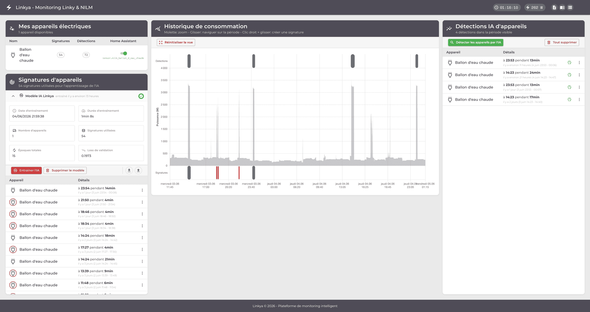
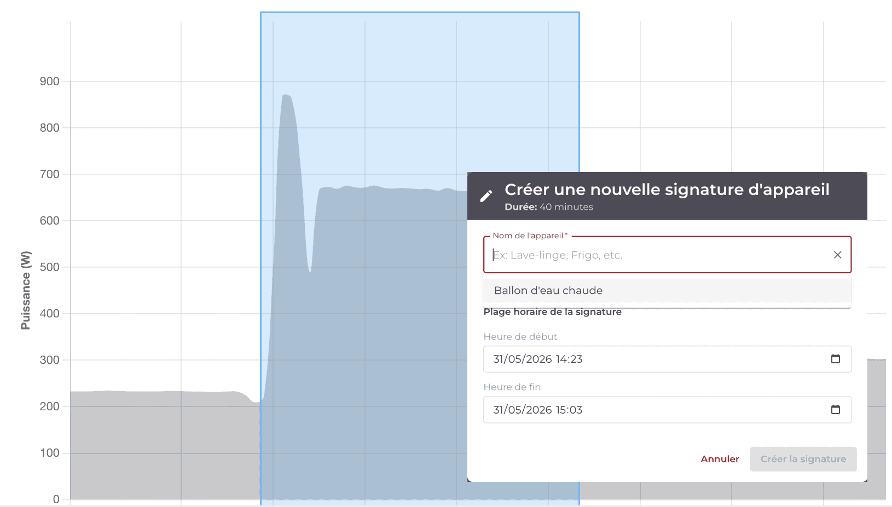
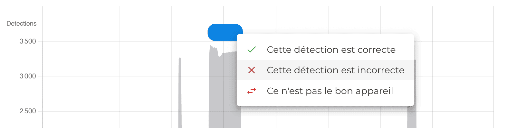

# Linkya — NILM for Home Assistant

[](https://github.com/rsaikali/linkya/actions/workflows/ci.yml)
[](LICENSE)

**Linkya** detects appliances that don't have a smart plug — water heater, dryer, oven — from your Linky smart meter's aggregate power curve, and publishes them to Home Assistant as native sensors.



## The problem

Home Assistant measures everything with a smart plug: TV, fridge, oven, router. Consumption is covered, appliance by appliance — except what can't be plugged in. My water heater is hardwired straight to the breaker panel, no way to slip a smart plug in. It runs several times a day, a few kilowatt-hours each cycle — probably my biggest single cost after winter heating — and I had no measurement of it.

**NILM** (Non-Intrusive Load Monitoring): infer each appliance's usage from the meter's aggregate signal alone. No extra hardware, no wiring — just the Linky curve you already have.

Under the hood, Linkya trains a **Seq2Point** model (LSTM/GRU + attention) on signatures *you* draw on *your own* curve — not a public dataset of someone else's water heater. That trade-off (a few dozen manual signatures upfront) is what makes detection accurate where generic models approximate.

## What you need

- **Home Assistant** with the Linky integration exposing `sensor.linky_sinsts` (or equivalent VA sensor)
- **Mosquitto add-on** in HA with `mqtt_statestream` enabled
- **Docker + Docker Compose** on a machine that can reach HA (same LAN)
- A Linky smart meter (France)

## Quick start

### 1 — Prerequisites in HA

**Enable `mqtt_statestream`** in `configuration.yaml`:

```yaml
mqtt_statestream:
  base_topic: statestream
  publish_attributes: false
```

**Create a long-lived access token**: HA → Profile → Security → Long-lived access tokens.

**Get your Mosquitto credentials**: HA Settings → Add-ons → Mosquitto → Configuration → note a user/password.

### 2 — Configure

```bash
git clone https://github.com/rsaikali/linkya
cd linkya
cp .env.example .env
```

Edit `.env` with your values:

```env
HA_URL=http://homeassistant.local:8123
HA_TOKEN=<your long-lived token>
HA_ENTITY_PAPP=sensor.linky_sinsts   # adjust to your entity name
HA_MQTT_HOST=homeassistant.local
HA_MQTT_PORT=1883
HA_MQTT_USER=homeassistant
HA_MQTT_PASSWORD=<your mqtt password>
```

### 3 — Start

```bash
make build
make up
make status   # all 5 services should be Up
```

Open **http://localhost** (or your machine's IP).

## How to use

> **Note**: the UI is currently French-first (*Consommation*, *Entraîner*, ...).
> Everything is understandable from the screenshots below; English i18n is on
> the roadmap.


### Annotate signatures

The power curve of the last 30 days loads automatically (backfilled from HA history). Select a time range when you know the appliance was running, name it, done.



A few dozen signatures are enough for a first training run — capturing a cycle takes a few seconds.

### Train

After adding signatures, training triggers automatically (every 5th positive signature). You can also trigger it manually from the UI.

### Detect

Detection runs automatically every 5 minutes on the last 2 hours. Trigger it manually to run on the full history.

### Refine with negative signatures

A correct detection can be validated by the user and turned into a **positive signature** — the model learns to recognize the appliance more reliably. A bad detection can be invalidated and turned into a **negative signature** — the model learns not to confuse the appliance with something else.



### Publish to HA

Toggle **Home Assistant** for any appliance you trust. Linkya then exposes, on a `Linkya NILM` device:

- **`binary_sensor.nilm_{appliance}`** — ON while a cycle is running (live, via MQTT discovery). State history starts at toggle time (HA can't backfill past states).
- **`sensor.nilm_{appliance}_confidence`** — confidence (%) of the last detection.
- **`linkya:{appliance}_energy`** — kWh, published as **external statistics** (like the Tibber/EDF integrations) via the HA WebSocket API, not an MQTT entity. External statistics are the only way to write hourly energy *into the past* — NILM always detects a cycle after it happened, and re-detections rewrite history. Shows up directly in the Energy Dashboard.
- **Diagnostic sensors** — model version, type, trained-at, train duration, signatures, epochs, train/val loss, detections total, last detection. No F1 (Linkya has no ground-truth labels).

## Architecture

Five services. No broker, no TimescaleDB, no nginx — the FastAPI backend serves
the React build and a single SSE stream for live UI updates.

```
HA (sensor.linky_sinsts)
  ├── MQTT statestream ─┐
  └── History API ──────┴─→ ha-ingest ─→ PostgreSQL (linky_realtime, 30d)

PostgreSQL ─→ nilm (Seq2Point GRU, FastAPI + APScheduler) ─→ nilm_detections

nilm_detections ─→ ha-publish ─→ HA MQTT discovery
                     ├── binary_sensor.nilm_*     (ON/OFF, live)
                     └── sensor.nilm_*_confidence (%, diagnostics)

nilm_detections ─→ backend ─→ HA WebSocket (recorder/import_statistics)
                     └── linkya:*_energy          (kWh, Energy Dashboard)

Browser ─→ backend (FastAPI: REST + SSE + React build) ─→ PostgreSQL
                     └── proxies train/detect/signatures → nilm
```

| Service | Stack | Role |
|---------|-------|------|
| `postgres` | PostgreSQL 16 | `linky_realtime` + NILM tables |
| `backend` | FastAPI | REST API, SSE bus, serves the React SPA, HA energy backfill |
| `nilm` | FastAPI + TensorFlow (CPU) | train / detect / signature processing + detect cron |
| `ha-ingest` | asyncio | HA MQTT statestream + History API backfill |
| `ha-publish` | asyncio | detections → HA MQTT discovery (binary + confidence + diagnostics) |

Live UI updates use one SSE endpoint (`GET /api/events`) — no WebSocket on the frontend side.

## Access

Production: the backend serves everything on one port. Behind a reverse proxy
(e.g. Nginx Proxy Manager) point a host at `backend:8000`. Dev: http://localhost:8000.

## Common commands

```bash
make up       # dev: start all services (docker-compose.override.yml)
make down     # stop
make clean    # stop + delete volumes (resets all data)
make status   # container status
make logs     # tail all logs
make train    # trigger training
make detect   # trigger detection on full history
make test     # run backend-service + nilm-service test suites
make lint     # flake8 + isort
make deploy   # prod build + restart (Pi / CD), skips the dev override
```

## NILM model

Seq2Point multi-output GRU with attention (TensorFlow/Keras). Trained on user-annotated signatures from the aggregate Linky curve — not a public dataset, so it learns *your* water heater, not an average one. Detection combines two paths: change-point detection + pattern matching (energy, duration, power shape) for clean on/off cycles, and Seq2Point sliding-window inference for more complex ones. Negative-signature feedback loop reduces false positives over time.

**Works well for**: water heater, dryer, EV charger, oven (high-power, clear on/off pattern).
**Harder to detect**: appliances with more complex, variable cycles (washing machine, dishwasher) need more signatures to stabilize; identical appliances (e.g. two identical space heaters) share the same electrical signature — Linkya sees *something* is on, but can't always tell which one. That's a physical limit of the aggregate signal, not a bug.

**References**:
- Hart, G.W. (1992). [Nonintrusive appliance load monitoring](https://ieeexplore.ieee.org/document/192069) — the founding NILM paper.
- Zhang et al. (2018). [Sequence-to-Point Learning with Neural Networks for NILM](https://arxiv.org/abs/1612.09106) — the reference architecture Linkya builds on.
- [NILMTK](https://github.com/nilmtk/nilmtk) — the academic reference toolkit (not used directly; built for research, not embedded deployment).

## Environment variables

See `.env.example` for the full list with comments. Required:

| Variable | Description |
|---|---|
| `HA_URL` | Home Assistant base URL |
| `HA_TOKEN` | Long-lived access token |
| `HA_ENTITY_PAPP` | Linky power sensor entity_id |
| `HA_MQTT_HOST` | Mosquitto broker hostname |
| `HA_MQTT_USER/PASSWORD` | Mosquitto credentials |

## License

MIT — see [LICENSE](LICENSE).
